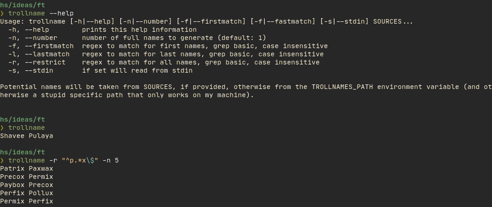

# Trollname
Generate pairs of six letter words.

`6-letter-english-words.txt` is not necessary, but very convenient.
[Fish](https://fishshell.com/), on the other hand, very much is.

Use `trollname --help` for help

